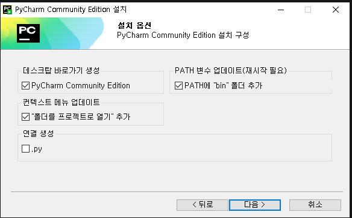

# Electronic-Garden

## [ Prequesite ]

### Pycharm 설치

* 실행 파일 Build 및 코드 작성을 위한 IDE 
* **이미 설치 되어 있을 경우에는 이 과정은 생략해도 무방**

**설치 과정**
1. 정식 홈페이지에서 다운로드 
	* https://www.jetbrains.com/ko-kr/pycharm/download/download-thanks.html?platform=windows&code=PCC
	* Community 버전(무료) 다운받을 것(2024.01.14)
2. 다운로드 폴더에서 exe 설치 파일을 실행
	* 다음 사진처럼 설치 옵션을 적용 (그 외에는 기본 옵션으로 그냥 둠)
	 

### Git 설치

* 코드의 버전 관리를 위한 툴로 해당 프로젝트의 코드를 다운받기 위해 사용
* **이미 설치 되어 있을 경우에는 이 과정은 생략해도 무방**

**설치 과정**
1. 정식 홈페이지에서 다운로드 
	*  https://git-scm.com/download/win
2. Git Bash를 검색하고 설치가 완료되었는지 확인

## [ Repo 다운받기 ]
