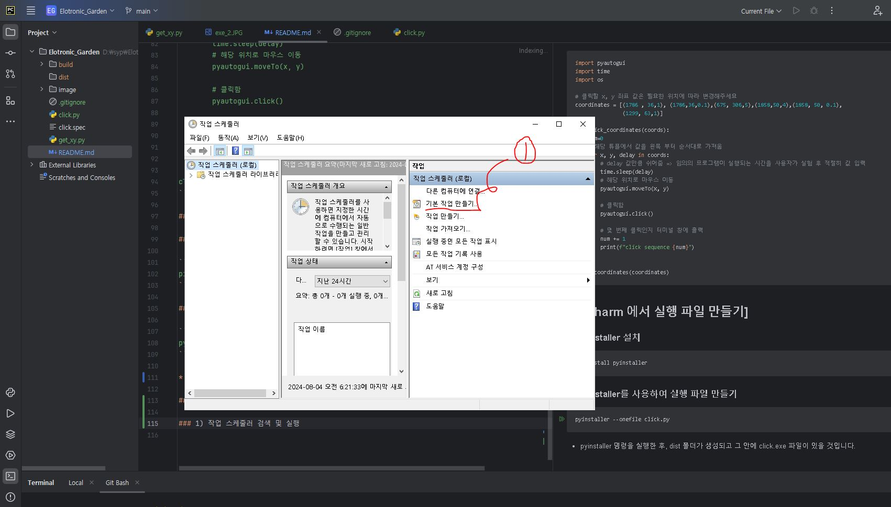
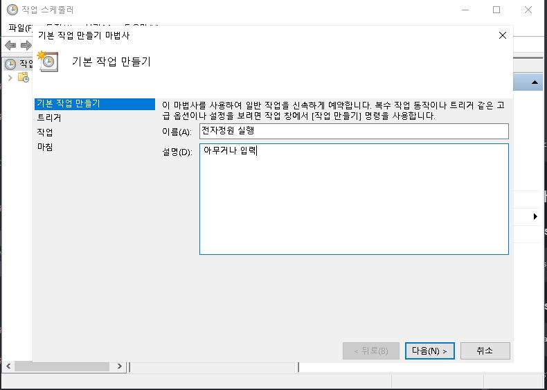
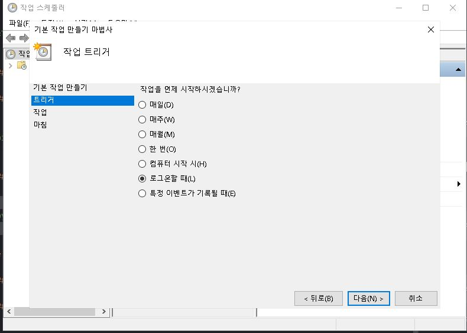
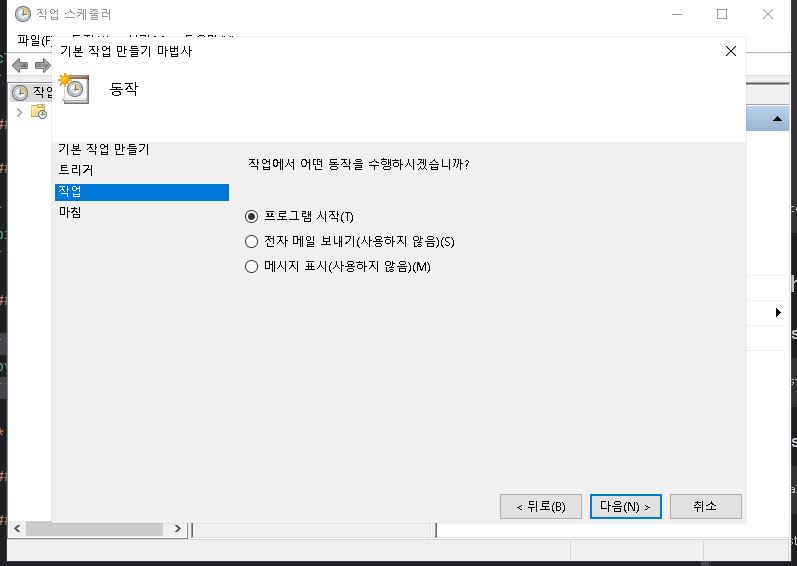
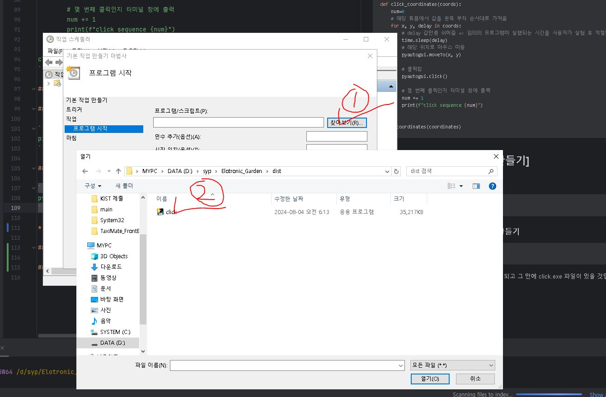
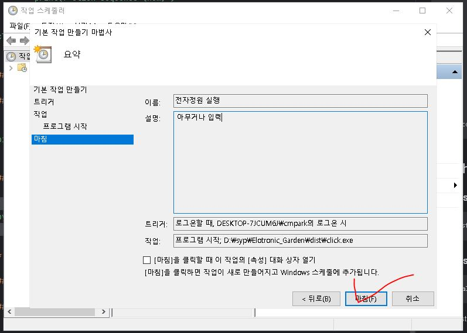

# Electronic-Garden

## [ Prequesite ]

### Pycharm 설치

* 실행 파일 Build 및 코드 작성을 위한 IDE 
* **이미 설치 되어 있을 경우에는 이 과정은 생략해도 무방**

**설치 과정**
1. 정식 홈페이지에서 다운로드 
	* https://www.jetbrains.com/ko-kr/pycharm/download/download-thanks.html?platform=windows&code=PCC
	* Community 버전(무료) 다운받을 것(2024.01.14)
2. 다운로드 폴더에서 exe 설치 파일을 실행
	* 다음 사진처럼 설치 옵션을 적용 (그 외에는 기본 옵션으로 그냥 둠)
	 


### Git 설치

* 코드의 버전 관리를 위한 툴로 해당 프로젝트의 코드를 다운받기 위해 사용
* **이미 설치 되어 있을 경우에는 이 과정은 생략해도 무방**

**설치 과정**
1. 정식 홈페이지에서 다운로드 
	*  https://git-scm.com/download/win
2. Git Bash를 검색하고 설치가 완료되었는지 확인

## [ Repo 다운받기 ]

* D: 드라이브에 "**garden**" 이라는 폴더 생성
* garden 폴더 우클릭 후에 **gitbash**로 열기를 선택
* 다음 명령어 입력

```bash
git clone https://github.com/Aconite-green/Electronic-Garden.git
```

* pycharm 으로 garden 폴더를 열기

## [ get_xy.py 실행]

* 'a' 입력시 x, y 픽셀 좌표 값을 구함 
  
  

### Error Case
```bash
1. ModuleNotFoundError: No module named 'pyautogui'

2. ModuleNotFoundError: No module named 'pynput'
```

**Solution** 
```bash
pip install pyautogui
pip install pynput
```

* 실행화면
  


## [ click.py 실행]

* "get_xy" 를 실행하고 얻은 픽셀 값을 사용해 클릭 매크로 파일을 빌드 함
* 어떤 순서로 얼만큼 기다리고 클릭해야하는지 사용자가 실험적으로 얻어야 함

```python
import pyautogui
import time
import os

# 클릭할 x, y 좌표 값은 필요한 위치에 따라 변경해주세요
coordinates = [(1786 , 36,1), (1786,36,0.1),(675, 306,5),(1858,50,4),(1858, 50, 0.1),
               (1299, 63,1)]

def click_coordinates(coords):
    num=0
    # 해당 튜플에서 값을 왼쪽 부터 순서대로 가져옴
    for x, y, delay in coords:
        # delay 값만큼 쉬어줌 => 임의의 프로그램이 실행되는 시간을 사용자가 실험 후 적절히 값 입력
        time.sleep(delay)
        # 해당 위치로 마우스 이동
        pyautogui.moveTo(x, y)

        # 클릭함
        pyautogui.click()

        # 몇 번째 클릭인지 터미널 창에 출력
        num += 1
        print(f"click sequence {num}")


click_coordinates(coordinates)
```

## [ pycharm 에서 실행 파일 만들기]

### 1) PyInstaller 설치

```bash
pip install pyinstaller
```

### 2) PyInstaller를 사용하여 실행 파일 만들기

```bash
pyinstaller --onefile click.py
```

* pyinstaller 명령을 실행한 후, dist 폴더가 생성되고 그 안에 click.exe 파일이 있을 것입니다.

## [ 실행 파일 작업 스케줄링]

* 윈도우 검색 창 -> 작업 스케줄러 검색 -> 실행
	
* 이름 & 설명 사용자 임의로 입력
    
* "로그온 할때" 로 설정 => 컴퓨터가 사용자 로그인 화면에서는 클릭을 해도 의미가 없음
	
* 프로그램 시작을 위한 작업 설정
	
* d:/garden/dist 안에 있는 click 실행 파일로 설정
	
* 마침
    


  
  
 

